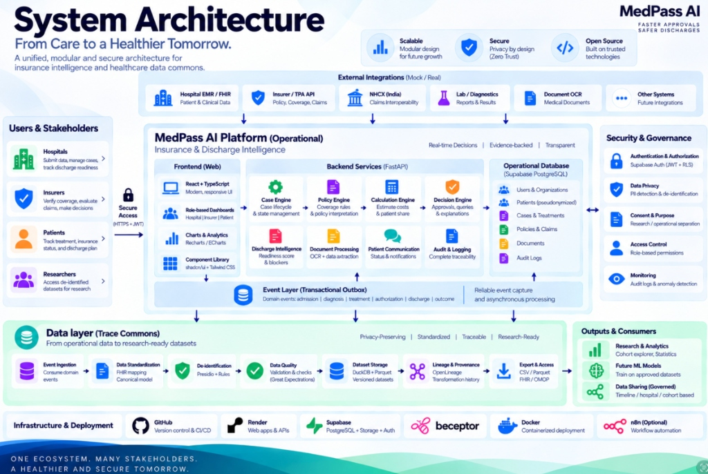

<div align="center">
  
# 🏥 MedPass AI 
  
**Next-Generation Healthcare Workflow & Anonymous Data Platform**

[](https://drive.google.com/file/d/1dmNqRtss118P9AUq0twe5tZ5-AvA5mn1/view?usp=sharing)

</div>

---
## 📖 Overview

**MedPass AI** is a comprehensive, modern healthcare workflow platform designed to bridge the gap between hospitals, insurers, and patients. It automates insurance approvals, analyzes hospital discharge blockers in real-time, and strictly adjudicates claims without hallucination. 

In addition to operational workflows, the platform includes **Trace Commons**—an isolated, strictly-governed database engine that converts live hospital data into 100% anonymous, highly-monetizable operational datasets for researchers and underwriters, fully compliant with the DPDP Act 2023.

---

## Core Platform Features

### 1. Smart Insurance Dashboards
- **Hospital Administration Portal:** Easily track active admissions, view real-time discharge blockers, and monitor the pre-authorization pipeline through beautiful, semantic data visualizations.
- **Insurer Adjudication Portal:** A secure, dedicated environment to review claims, automatically map billing codes, and instantly flag fraudulent or missing data via a deterministic rules engine.
- **Patient Portal:** A jargon-free, transparent view of a patient's insurance coverage, showing exactly what is covered, what was rejected, and why.

### 2. AI-Powered Medical Chatbot
- **Context-Aware Assistance:** Ask our built-in assistant about cases, claim statuses, and policy details.
- **Deterministic Guardrails:** The chatbot seamlessly reads clinical data and returns beautifully formatted, accurate markdown answers. We implemented strict word-boundary NLP matching to completely eliminate patient-name hallucinations during generic queries.

### 3. Trace Commons (Data Export Engine)
- **Zero-PII Architecture:** Strictly reserved for administrators, this engine scrubs all Protected Health Information (PHI) and Personally Identifiable Information (PII). Exact dates become generalized months, and exact ages become 15-year brackets.
- **Premium Data Formats:** Generates research-ready ZIP bundles containing enriched CSVs and highly-compressed **Apache Parquet** files, including detailed Data Dictionaries mapping clinical and financial domains.

---

## 🏆 Hackathon Tracks Implemented

| Hackathon Track | Implementation Details |
|---|---|
| **1. GitHub Developer Track** | Implemented a clean Git tree, robust **GitHub Actions CI/CD pipeline** (automatically builds frontend and validates backend syntax on push), CODEOWNERS, and issue/PR templates. |
| **2. Beeceptor Mocking Track** | Built a mock client & simulator for Insurer Preauthorization, NHCX Claim Submission, and FHIR endpoints handling Success, Query, Rejection, and 500 error scenarios. |
| **3. Render / Vercel Cloud Deployment Track** | Multi-service blueprints, containerized backend configurations, and highly-optimized Vite/React frontend deployed via Vercel Serverless with strict environment variable configuration. |
| **4. n8n Automation Track** | Engineered a decoupled outbound webhook dispatcher firing on case lifecycle events (e.g., `CLAIM_SUBMITTED`, `STATUS_CHANGED`) with a ready-to-import n8n operational workflow. |

---

## 🏗 System Architecture



---

## 🛠 Technology Stack

A modular, API-first stack for insurance authorization, discharge intelligence, and governed healthcare data.

| Layer | Technology | Purpose in MedPass AI | Role |
|---|---|---|---|
| **Frontend** | React + TypeScript | Role-based stakeholder dashboards | Hospital • Insurer/TPA • Patient • Trace Commons |
| **UI System** | Tailwind CSS + shadcn/ui | Consistent, accessible interface components | Reusable cards, tables, dialogs and workflow UI |
| **Visualization** | Recharts / ECharts | Operational and Trace analytics | Case funnel, readiness, cohort and trend views |
| **Backend API** | FastAPI + Python | REST APIs and domain orchestration | Cases, claims, documents, Trace, integrations |
| **ORM / Data Access** | SQLAlchemy | Typed persistence and domain data access | Operational schema + Trace schema |
| **Operational DB** | PostgreSQL (Supabase) | System of record for operational workflows | Cases, policies, claims, documents, audit and organizations |
| **Auth & Access** | Supabase Auth + JWT / RLS | Authentication and tenant-aware access control | Target production security model |
| **Policy & Decision** | Deterministic Python engines | Coverage, calculation, decision and readiness logic | Rules first; evidence-backed explanations |
| **Document Intelligence** | OCR + LLM assistance | Extract structured fields from medical/insurance documents | LLM assists ambiguity/extraction; not the authoritative decision maker |
| **Event Layer** | Transactional Outbox | Reliable domain-event capture | Admission → diagnosis → treatment → authorization → discharge → outcome |
| **Data Layer** | Canonical schema | Governed longitudinal healthcare representation | Privacy-preserving subject/facility/encounter and clinical/workflow domains |
| **Privacy** | Presidio + deterministic rules | PII detection, de-identification and policy gates | Fail-closed publication gate; configurable governance |
| **Analytics / Export** | DuckDB + Parquet | Cohort queries and efficient dataset exports | Timeline, hospital and cohort-based selection |
| **Interoperability** | FHIR + OMOP adapters | Exchange and research-standard representations | FHIR for interoperability; OMOP for research analytics |
| **Data Quality** | Validation framework | Completeness, temporal and referential checks | Quality report attached to dataset versions |
| **Lineage / Provenance**| OpenLineage-compatible model| Transformation and dataset provenance | Track source → transformation → published version |
| **Mock Integrations** | Beeceptor | Simulate payer/external APIs | Hackathon-friendly integration testing |
| **Workflow Automation** | n8n (optional) | Non-core workflow automation | Use only where automation adds value |
| **Container / Runtime** | Docker | Reproducible application packaging | Backend/frontend deployment consistency |
| **CI/CD** | GitHub Actions | Automated build, test and deployment checks | Quality gate for every change |
| **Deployment** | Render / Vercel | Host web apps, APIs and database | Cloud deployment path for MVP/demo |

---

## ⚙️ CI/CD Pipeline & Deployment

This project includes a fully automated Continuous Integration & Continuous Deployment (CI/CD) pipeline via **GitHub Actions**.

*   **Continuous Integration (CI):** On every push or pull request to the `main` branch, GitHub Actions automatically provisions an Ubuntu environment, installs all Node.js/Python dependencies, builds the Vite frontend, and validates the backend Python syntax.
*   **Continuous Deployment (CD):** 
    *   **Frontend:** Deploys instantly via **Vercel**. Any updates to the `main` branch trigger a live production build.
    *   **Backend:** Deploys seamlessly to cloud platforms (like Render or Railway) by dynamically binding to the `$PORT` environment variable.

---

## 💻 Local Setup (For Developers)

### Backend Setup (Python/FastAPI)
```bash
cd backend
python3 -m venv venv
source venv/bin/activate
pip install -r requirements.txt

# Seed the database with demo cases and trace encounters
python ../scripts/seed_demo.py
python ../scripts/seed_trace.py

# Start the server
uvicorn app.main:app --reload --port 8000
```

### Frontend Setup (React/Vite)
```bash
cd frontend
npm install
npm run dev
```
Navigate to `http://localhost:5173` in your browser.

---

## 🔄 Recent Updates & Polish
- **Typography Overhaul:** Replaced external CDNs with Plus Jakarta Sans (Google Sans) for a crisp, enterprise-grade UI aesthetic.
- **Dynamic Infographics Redesign:** Overhauled the Hospital Preauth Pipeline and Discharge Blocker charts with live data mapping, semantic colors, and smooth rendering animations.
- **Trace Export Expansion:** Upgraded the Trace Commons engine to produce richly detailed clinical/financial columns without compromising PII constraints.
  
---

<div align="center">
  <i>Built with ❤️ for DSU DevHack 3.0</i>
</div>
